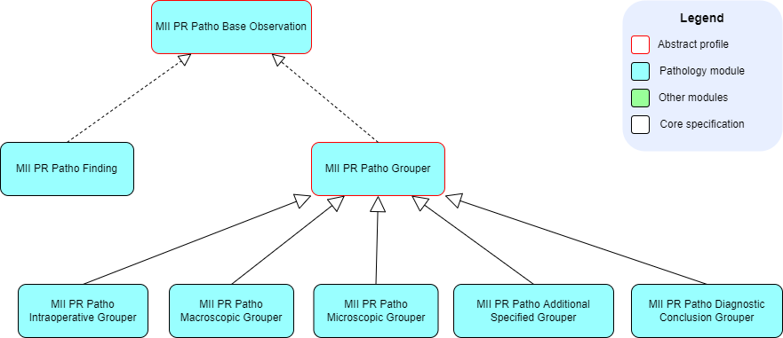

# Profile - MII IG Modul Patho v2027.0.0-ballot.rc1

* [**Table of Contents**](toc.md)
* **Profile**

## Profile

Alle Elemente des Kerndatensatzes, angepasst an die Details und Anforderungen für die Use Cases der Medizininformatik-Initiative, werden als FHIR StructureDefinitions beschrieben. Die Notwendigkeit der Anpassung wird in textueller Form unterhalb der jeweiligen Profile erläutert.

Die Arbeiten der Kerndatensatzspezifikationen basieren, wo möglich, auf internationalen Standards und Terminologien — insbesondere dem [Anatomic Pathology Structured Report (APSR)](https://art-decor.org/art-decor/decor-templates--psr-?section=templates&id=1.3.6.1.4.1.19376.1.8.1.1.1&effectiveDate=2014-05-13T11:57:57&language=de-DE) und der [International Patient Summary (IPS)](http://hl7.org/fhir/uv/ips/history.html). Die Anpassung an die Gegebenheiten des deutschen Gesundheitswesens erfolgt über die [Deutschen Basisprofile von HL7 Deutschland](https://simplifier.net/basisprofil-de-r4).

### Übersicht

| | | |
| :--- | :--- | :--- |
| [MII PR Patho Report](StructureDefinition-mii-pr-patho-report.md) | DiagnosticReport | Der komplette Befundbericht, ohne Dokumenteigenschaften |
| [MII PR Patho Composition](StructureDefinition-mii-pr-patho-composition.md) | Composition | Dokumentkopf und Gliederung des Berichts |
| [MII PR Patho Bundle](StructureDefinition-mii-pr-patho-bundle.md) | Bundle | Signierbares Dokument-Bundle |
| [MII PR Patho Service Request](StructureDefinition-mii-pr-patho-service-request.md) | ServiceRequest | Untersuchungsauftrag des Einsenders |
| [MII PR Patho Specimen](StructureDefinition-mii-pr-patho-specimen.md) | Specimen | Probe auf allen Bearbeitungsebenen (Part, Block, Schnitt) |
| [MII PR Patho Base Observation](StructureDefinition-mii-pr-patho-base-observation.md) | Observation (abstrakt) | Gemeinsame Basis aller Observations dieses Moduls |
| [MII PR Patho Section Grouper](StructureDefinition-mii-pr-patho-section-grouper.md) | Observation (abstrakt) | Basis der Beobachtungsberichtabschnitte |
| [MII PR Patho Intraoperative Grouper](StructureDefinition-mii-pr-patho-intraoperative-grouper.md) | Observation | Abschnitt Intraoperative Beurteilung |
| [MII PR Patho Macroscopic Grouper](StructureDefinition-mii-pr-patho-macroscopic-grouper.md) | Observation | Abschnitt Makroskopische Beurteilung |
| [MII PR Patho Microscopic Grouper](StructureDefinition-mii-pr-patho-microscopic-grouper.md) | Observation | Abschnitt Mikroskopische Beurteilung |
| [MII PR Patho Additional Specified Grouper](StructureDefinition-mii-pr-patho-additional-specified-grouper.md) | Observation | Abschnitt Zusätzliche spezifizierte Beobachtungen |
| [MII PR Patho Diagnostic Conclusion Grouper](StructureDefinition-mii-pr-patho-diagnostic-conclusion-grouper.md) | Observation | Abschnitt Diagnostische Schlussfolgerung |
| [MII PR Patho Finding](StructureDefinition-mii-pr-patho-finding.md) | Observation | Semantisch annotierte Einzelbeobachtung |
| [MII PR Patho Attached Image](StructureDefinition-mii-pr-patho-attached-image.md) | Media | In den Bericht eingebettetes Bild |
| [MII PR Patho Active Problems List](StructureDefinition-mii-pr-patho-active-problems-list.md) | List | Fragestellung des Einsenders |
| [MII PR Patho History Of Present Illness](StructureDefinition-mii-pr-patho-history-of-present-illness.md) | List | Anamnese des Einsenders |
| [MII PR Patho Problem List Item](StructureDefinition-mii-pr-patho-problem-list-item.md) | Condition | Einzelner Eintrag der beiden Listen |
| [MII LM Patho Logical Model](StructureDefinition-mii-lm-patho-logical-model.md) | Logical Model | Informationsmodell des Moduls |

Die vollständige, automatisch erzeugte Liste aller Artefakte einschließlich Terminologien und Beispiele findet sich unter [Übersicht](artifacts.md).

### Verpflichtende und must-support-Elemente

Für verpflichtende oder als must-support markierte Elemente gelten die entsprechenden [Regeln der IPS](http://hl7.org/fhir/uv/ips/STU1/design.html#must-support), die auch für diesen Implementation Guide gelten.

### Anforderungsdokumentation

Anforderungen in dieser Spezifikation werden durch folgende in Großbuchstaben geschriebenen Schlüsselworte basierend auf [RFC-2119](https://datatracker.ietf.org/doc/html/rfc2119) gekennzeichnet:

| | |
| :--- | :--- |
| MUSS / MÜSSEN | MUST / SHALL |
| DARF NICHT / DÜRFEN NICHT | MUST NOT / SHALL NOT |
| VERPFLICHTEND | REQUIRED |
| SOLLTE / SOLLTEN | SHOULD |
| SOLLTE NICHT / SOLLTEN NICHT | SHOULD NOT |
| EMPFOHLEN | RECOMMENDED |
| KANN / OPTIONAL | MAY |

### Pathologie-Observations

Alle Observations im Modul Pathologie-Befund haben das abstrakte Profil **MII PR Patho Base Observation** als gemeinsame Basis.

### Gesamtübersicht aller Profile und Referenzen

