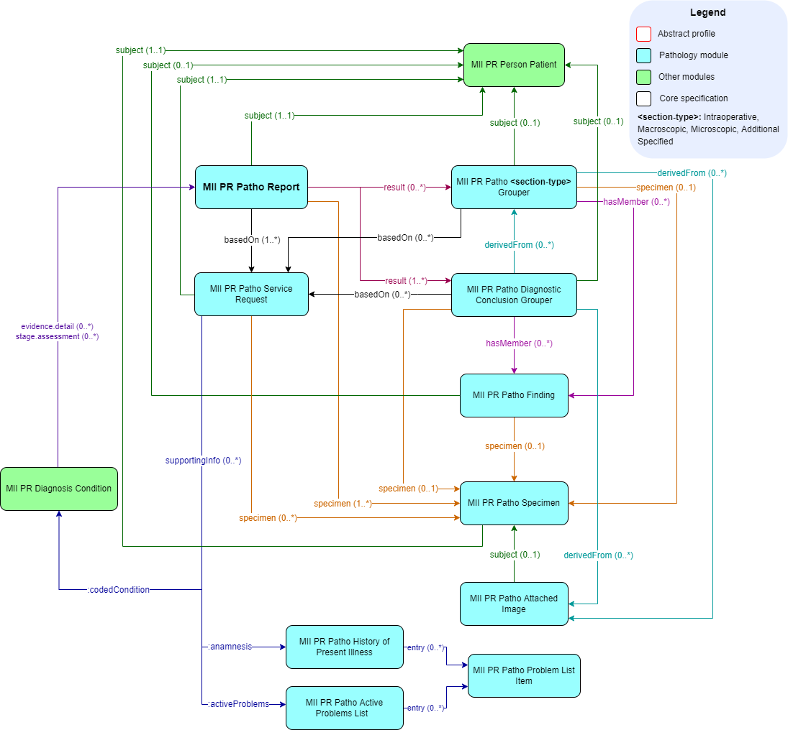

# Profiles - MII IG Modul Patho v2027.0.0-ballot.rc1

* [**Table of Contents**](toc.md)
* **Profiles**

## Profiles

All elements of the core data set, adapted to the details and requirements of the use cases of the Medical Informatics Initiative, are described as FHIR StructureDefinitions. The necessity of each adaptation is explained in textual form below the respective profile.

The work on the core data set specifications is based, wherever possible, on international standards and terminologies — in particular the [Anatomic Pathology Structured Report (APSR)](https://art-decor.org/art-decor/decor-templates--psr-?section=templates&id=1.3.6.1.4.1.19376.1.8.1.1.1&effectiveDate=2014-05-13T11:57:57&language=de-DE) and the [International Patient Summary (IPS)](http://hl7.org/fhir/uv/ips/history.html). The adaptation to the conditions of the German healthcare system is achieved by using the [German base profiles of HL7 Deutschland](https://simplifier.net/basisprofil-de-r4).

### Overview

| | | |
| :--- | :--- | :--- |
| [MII PR Patho Report](StructureDefinition-mii-pr-patho-report.md) | DiagnosticReport | The complete pathology report, without document properties |
| [MII PR Patho Composition](StructureDefinition-mii-pr-patho-composition.md) | Composition | Document header and structure of the report |
| [MII PR Patho Bundle](StructureDefinition-mii-pr-patho-bundle.md) | Bundle | Signable document bundle |
| [MII PR Patho Service Request](StructureDefinition-mii-pr-patho-service-request.md) | ServiceRequest | Examination request of the sender |
| [MII PR Patho Specimen](StructureDefinition-mii-pr-patho-specimen.md) | Specimen | Specimen at every processing level (part, block, section) |
| [MII PR Patho Base Observation](StructureDefinition-mii-pr-patho-base-observation.md) | Observation (abstract) | Common basis of all observations in this module |
| [MII PR Patho Section Grouper](StructureDefinition-mii-pr-patho-section-grouper.md) | Observation (abstract) | Basis of the observation report sections |
| [MII PR Patho Intraoperative Grouper](StructureDefinition-mii-pr-patho-intraoperative-grouper.md) | Observation | Section intraoperative assessment |
| [MII PR Patho Macroscopic Grouper](StructureDefinition-mii-pr-patho-macroscopic-grouper.md) | Observation | Section macroscopic assessment |
| [MII PR Patho Microscopic Grouper](StructureDefinition-mii-pr-patho-microscopic-grouper.md) | Observation | Section microscopic assessment |
| [MII PR Patho Additional Specified Grouper](StructureDefinition-mii-pr-patho-additional-specified-grouper.md) | Observation | Section additional specified observations |
| [MII PR Patho Diagnostic Conclusion Grouper](StructureDefinition-mii-pr-patho-diagnostic-conclusion-grouper.md) | Observation | Section diagnostic conclusion |
| [MII PR Patho Finding](StructureDefinition-mii-pr-patho-finding.md) | Observation | Semantically annotated individual observation |
| [MII PR Patho Attached Image](StructureDefinition-mii-pr-patho-attached-image.md) | Media | Image embedded in the report |
| [MII PR Patho Active Problems List](StructureDefinition-mii-pr-patho-active-problems-list.md) | List | Clinical question of the sender |
| [MII PR Patho History Of Present Illness](StructureDefinition-mii-pr-patho-history-of-present-illness.md) | List | Medical history provided by the sender |
| [MII PR Patho Problem List Item](StructureDefinition-mii-pr-patho-problem-list-item.md) | Condition | Individual entry of the two lists |
| [MII LM Patho Logical Model](StructureDefinition-mii-lm-patho-logical-model.md) | Logical Model | Information model of the module |

The complete, automatically generated list of all artifacts, including terminologies and examples, can be found under [Overview](artifacts.md).

### Mandatory and must-support elements

For mandatory elements or elements marked as must-support, the corresponding [rules of the IPS](http://hl7.org/fhir/uv/ips/STU1/design.html#must-support) apply, which also apply to this implementation guide.

### Requirement documentation

Requirements in this specification are marked by the following keywords written in capital letters, based on [RFC-2119](https://datatracker.ietf.org/doc/html/rfc2119):

| | |
| :--- | :--- |
| MUSS / MÜSSEN | MUST / SHALL |
| DARF NICHT / DÜRFEN NICHT | MUST NOT / SHALL NOT |
| VERPFLICHTEND | REQUIRED |
| SOLLTE / SOLLTEN | SHOULD |
| SOLLTE NICHT / SOLLTEN NICHT | SHOULD NOT |
| EMPFOHLEN | RECOMMENDED |
| KANN / OPTIONAL | MAY |

### Pathology observations

All observations in the module Pathology Report have the abstract profile **MII PR Patho Base Observation** as their common basis.

### Overall view of all profiles and references

