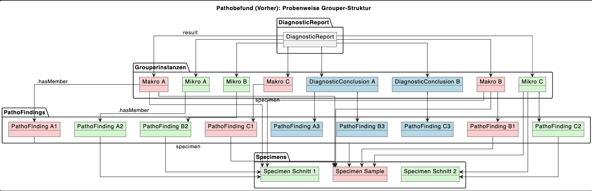
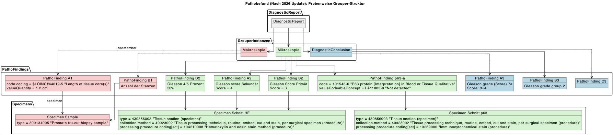
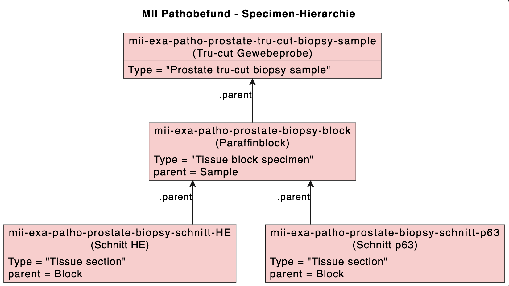

# Hierarchy and workflow - MII IG Modul Patho v2027.0.0-ballot.rc

* [**Table of Contents**](toc.md)
* [**Use cases and information model**](anwendungsfaelle.md)
* **Hierarchy and workflow**

## Hierarchy and workflow

### Use of the grouper profiles

The use of the groupers was changed in the 2026 update in such a way that only one grouper of each kind may be referenced per report (DiagnosticReport). In order to visualize this change, two relationship diagrams were produced showing the state before and after the update:

Previous state (until 2025):

Current state (from 2026):

With this change there are no references to Specimen within the groupers; the hierarchy, i.e. the referencing of the specimens among each other, is therefore essential:

### Specimen hierarchy

In the following, the hierarchy of the specimens is described in more detail by means of a relationship diagram and a tabular example:

The root element (sample) is specimen material clinically obtained from a patient and corresponds to a part in the pathology workflow. Child elements are blocks and sections, or a cytological preparation. The child specimens (blocks and sections) should always reference at least their direct parent specimen via the element Specimen.parent.

According to the domain analysis model, the different processing levels of specimens have to be specified separately:

#### Part (clinically collected specimen)

| | | |
| :--- | :--- | :--- |
| Specimen.type | descendants-of 123038009 Specimen (specimen) | SHOULD |
| Specimen.parent | 0..0 | SHOULD NOT |
| Specimen.collection.method | descendants-of 118292001 Removal (procedure) | SHOULD |
| Specimen.collection.bodySite | descendants-of 123037004 Body structure (body structure) | SHOULD |
| Specimen.processing | 0..0 | SHOULD NOT |

-------

#### Block (results of the macroscopic sectioning)

| | | |
| :--- | :--- | :--- |
| Specimen.type | descendants-of 1201985008 Tissue block specimen (specimen) | SHOULD |
| Specimen.parent | Part | SHOULD |
| Specimen.collection.method | descendants-of 168126000 Sample macroscopy (procedure) | SHOULD |
| Specimen.collection.bodySite | descendants-of 123037004 Body structure (body structure) | SHOULD |
| Specimen.collection.bodySite.extension:bodyStructure | Reference to a BodyStructure resource, in particular when several blocks originate from one part | SHOULD |
| Specimen.processing | 787376009 Preparation of formalin fixed paraffin embedded tissue specimen (procedure) | SHOULD |

-------

#### Slide (section and staining)

| | | |
| :--- | :--- | :--- |
| Specimen.type | descendants-of 430856003 Tissue section (specimen) | SHOULD |
| Specimen.parent | Block | SHOULD |
| Specimen.collection.method | descendants-of 13283003 Tissue processing technique (procedure) | SHOULD |
| Specimen.collection.bodySite | descendants-of 123037004 Body structure (body structure) | SHOULD |
| Specimen.collection.bodySite.extension:bodyStructure | See block | SHOULD |
| Specimen.processing | descendants-of 127790008 Staining method (procedure) | SHOULD |

### Life cycle of the document

The description of the life cycle of the document "pathology report" — e.g. whether it is still current or has been replaced or supplemented by another document — determines the completeness and currency of the content of the readable document at the document consumer, i.e. the sender/requester of the examination in pathology. The .status elements in the FHIR profiles **Observation**, **DiagnosticReport** and **Composition** of the report are intended to make this life cycle description possible for document registries and document repositories.

Scenario 1: A report on a breast core biopsy is issued as preliminary because an immunohistochemical examination has been delayed. Once its result is available, the main report is completed. A further immunohistochemical examination of the Her2neu expression is, for logistical reasons, only carried out in the following week. A follow-up report is written about its result. Because of an internal review, the expression status "Her2-negative" communicated in the follow-up report has to be corrected, since it is in fact "Her2-low". A corrected report is issued for this purpose. All reports following the main report include their predecessors. The pathology facility must assume that new versions of a document are handled in the registry with the XDSDocumentEntry.parentDocumentRelationship "RPLC" (replace). The receiving system always presents the synoptic overview of all report parts.

| | | | | |
| :--- | :--- | :--- | :--- | :--- |
| Bundle.identifier | E12345/25-1 | E12345/25-2 | E12345/25-3 | E12345/25-4 |
| Bundle.signature | Dr. A (head physician) | Dr. A | Dr. C (specialist) | Dr. D (senior physician) |
| Composition.id | Abcd | Abcde | Abcdf | Abcdg |
| Composition.identifier | E12345/25 | E12345/25 | E12345/25 | E12345/25 |
| Composition.ext.:version | 1 | 2 | 3 | 4 |
| Composition.status | Final | Final | Final | Final |
| Composition.author | Dr. B (specialist) | Dr. B | Dr. C | Dr. D |
| Composition.attester | Dr. A | Dr. A | Dr. A | Dr. A |
| Composition.relatesTo.target.[x] | E9345/25 (previous report, if existing) | Ref. Abcd | Ref. Abcde | Ref. Abcdf |
| Composition.relatesTo.code |   |   | replaces | replaces |
| DiagnosticReport.ext.:related-report | E9345/25 (previous report, if existing) | E9345/25 (previous report, if existing) | E9345/25 (previous report, if existing) | E9345/25 (previous report, if existing) |
| DiagnosticReport.ext.:set-ID | E12345/25 | E12345/25 | E12345/25 | E12345/25 |
| DiagnosticReport.status | Preliminary | Final | Amended | Corrected |
| DiagnosticReport.performer | Dr. B | Dr. B | Dr. C | Dr. D |
| DiagnosticReport.resultsInterpreter | Dr. A | Dr. A | Dr. A |   |
| DiagnosticReport.custodian | IfP | IfP | IfP | IfP |
| 1.Observation.identifier | E10345/25_A_1_HE |   |   |   |
| 1.Observation.status | Final |   |   |   |
| 1.Observation.performer | Dr. B |   |   |   |
| 2.Observation.identifier |   | E10345/25_A_1_ER |   |   |
| 2.Observation.status |   | Final |   |   |
| 2.Observation.performer |   | Dr. B |   |   |
| 3.Observation.identifier |   |   | E10345/25_A_1_Her2 |   |
| 3.Observation.status |   |   | Final |   |
| 3.Observation.performer |   |   | Dr. C |   |
| 4.Observation.identifier |   |   |   | E10345/25_A_1_Her2 |
| 4.Observation.status |   |   |   | Corrected |
| 4.Observation.performer |   |   |   | Dr. D |

Scenario 2: As above. All report parts stand on their own. The receiving system ensures the correct assignment in the respective complete, current human-readable presentation. The pathology facility must assume that new versions of a document are handled in the registry with the XDSDocumentEntry.parentDocumentRelationship "APND" (append). The consolidation then has to take place via DR.ext.:set-ID. This scenario requires a different versioning and different identifiers. It is **not recommended** for pathology reports.

| | | | | |
| :--- | :--- | :--- | :--- | :--- |
| Bundle.identifier | E12345/25-1V | E12345/25-1 | E12345/25-1Z | E12345/25-1K |
| Bundle.signature | Dr. A | Dr. A | Dr. B | Dr. D |
| Composition.id | Abcd | Abcde | Abcdf | Abcdg |
| Composition.identifier | E12345/25 | E12345/25 | E12345/25 | E12345/25 |
| Composition.ext.:version | 1 | 1 | 1 | 2 |
| Composition.status | Final | Final | Final | Final |
| Composition.author | Dr. B | Dr. B | Dr. C | Dr. D |
| Composition.attester | Dr. A | Dr. A |   |   |
| Composition.relatesTo.target.[x] | E9345/25 (previous report, if existing) | Ref. Abcd | Ref. Abcde | Ref. Abcdf |
| Composition.relatesTo.code |   |   | appends | replaces |
| DiagnosticReport.ext.:related-report | E9345/25 (previous report, if existing) | E9345/25 (previous report, if existing) | E9345/25 (previous report, if existing) | E9345/25 (previous report, if existing) |
| DiagnosticReport.ext.:set-ID | E12345/25 | E12345/25 | E12345/25 | E12345/25 |
| DiagnosticReport.status | Preliminary | Final | Final | Corrected |
| DiagnosticReport.performer | Dr. B | Dr. B | Dr. C | Dr. D |
| DiagnosticReport.resultsInterpreter | Dr. A | Dr. A |   |   |
| DiagnosticReport.custodian | IfP | IfP | IfP | IfP |
| Observation.identifier | E10345/25_A_1_HE | E10345/25_A_1_ER | E10345/25_A_1_Her2 | E10345/25_A_1_Her2K |
| Observation.status | Final | Final | Final | Corrected |
| Observation.performer | Dr. B | Dr. B | Dr. C | Dr. D |

For the IHE profile APSR2.1 (CDA) the following specification applies: For the APSR content module XDSDocumentEntry.parentDocumentRelationship is constrained to the "RPLC" value. When there is a parent document the current document is a new version of the parent document, replacing it.

Note 1: A non-final anatomic pathology report published in an XDS infrastructure will likely be replaced afterwards by the final report. When this event occurs, the Content Creator Actor SHALL apply the following rules:

ClinicalDocument/setId SHALL have the same value in the new report as in the replaced report. ClinicalDocument/versionNumber SHALL be incremented in the replacing report (i.e. the final one). ClinicalDocument/relatedDocument@typeCode attribute SHALL be valued ”RPLC” ClinicalDocument/relatedDocument/parentDocument/id in the new report SHALL be equal to ClinicalDocument/ id of the replaced document. The Document Source Actor SHALL apply the following rules on XDSDocumentEntry metadata:

The final report SHALL be associated with the previously published one, using RPLC relationship and the previous report SHALL be “Deprecated” as described in ITI TF-2:4.1.6.1.

Note 2: A non-final report can also be replaced by a more recent, albeit still non-final report. The rules above also apply in this case.

Note 3: A final report can also be replaced by a corrective final report. The rules above also apply in this case.

Note 4: A new version of a report SHOULD have an Update Organizer in its Diagnostic Conclusion

carrying information about what has been changed in comparison with the immediate previous report, and what is the clinical significance of that change.

### Profile overview and dependencies

#### FHIR profiles

| | |
| :--- | :--- |
|   | For mandatory elements or elements marked as must-support, reference is made here to the corresponding[rules of the IPS](http://hl7.org/fhir/uv/ips/STU1/design.html#must-support), which also apply to this implementation guide. |

The work on the core data set specifications is based, wherever possible, on international standards and terminologies. The [Anatomic Pathology Structured Report (APSR)](https://art-decor.org/art-decor/decor-templates--psr-?section=templates&id=1.3.6.1.4.1.19376.1.8.1.1.1&effectiveDate=2014-05-13T11:57:57&language=de-DE) and the [International Patient Summary (IPS)](http://hl7.org/fhir/uv/ips/history.html) should be highlighted in particular. An adaptation to the general conditions of the German healthcare system is achieved by using the [German base profiles of HL7 Deutschland](https://simplifier.net/basisprofil-de-r4).

All elements of the core data set, adapted to the details and requirements of the use cases of the Medical Informatics Initiative, are described below in the form of FHIR StructureDefinitions. The necessity of adapting the FHIR profiles is explained in textual form below the respective profiles.

#### Requirement documentation

Requirements in this specification are marked by the following keywords written in capital letters, based on [RFC-2119](https://datatracker.ietf.org/doc/html/rfc2119):

| | |
| :--- | :--- |
| MUSS / MÜSSEN | MUST / SHALL |
| DARF NICHT / DÜRFEN NICHT | MUST NOT / SHALL NOT |
| VERPFLICHTEND | REQUIRED |
| SOLLTE / SOLLTEN | SHOULD |
| SOLLTE NICHT / SOLLTEN NICHT | SHOULD NOT |
| EMPFOHLEN | RECOMMENDED |
| KANN / OPTIONAL | MAY |

#### Profile overview

* [MII PR Patho Pathology Report (DiagnosticReport)](StructureDefinition-mii-pr-patho-report.md)
* [MII PR Patho Examination Request (ServiceRequest)](StructureDefinition-mii-pr-patho-service-request.md)
* [MII PR Patho Specimen (Specimen)](StructureDefinition-mii-pr-patho-specimen.md)
* [MII PR Patho Report Summary (Composition)](StructureDefinition-mii-pr-patho-composition.md)
* [MII PR Patho Report Document (Bundle)](StructureDefinition-mii-pr-patho-bundle.md)
* [MII PR Patho Observation (abstract Observation)](StructureDefinition-mii-pr-patho-base-observation.md)
* [MII PR Patho Observation Report Section (abstract Observation)](StructureDefinition-mii-pr-patho-section-grouper.md)
* [MII PR Patho Macroscopic Assessment (Observation)](StructureDefinition-mii-pr-patho-macroscopic-grouper.md)
* [MII PR Patho Microscopic Assessment (Observation)](StructureDefinition-mii-pr-patho-microscopic-grouper.md)
* [MII PR Patho Intraoperative Assessment (Observation)](StructureDefinition-mii-pr-patho-intraoperative-grouper.md)
* [MII PR Patho Diagnostic Conclusion (Observation)](StructureDefinition-mii-pr-patho-diagnostic-conclusion-grouper.md)
* [MII PR Patho Additional Observation (Observation)](StructureDefinition-mii-pr-patho-additional-specified-grouper.md)
* [MII PR Patho Finding (Observation)](StructureDefinition-mii-pr-patho-finding.md)
* [MII PR Patho Attached Image (Media)](StructureDefinition-mii-pr-patho-attached-image.md)
* [MII PR Patho Active Problems (List)](StructureDefinition-mii-pr-patho-active-problems-list.md)
* [MII PR Patho History of Present Illness (List)](StructureDefinition-mii-pr-patho-history-of-present-illness.md)
* [MII PR Patho Problem (Condition)](StructureDefinition-mii-pr-patho-problem-list-item.md)

#### Pathology observations

All observations in the module Pathology Report have the abstract observation profile **MII PR Base Observation** as their common basis.

#### Overall view of all profiles and references

