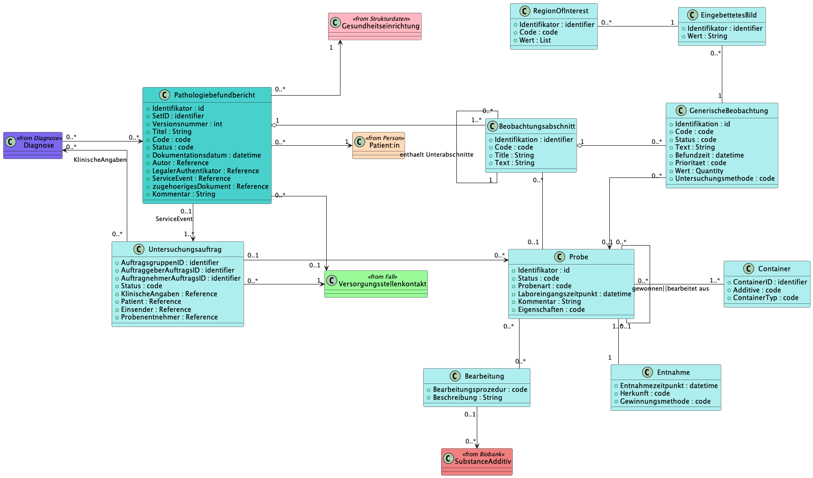

# UML - MII IG Modul Patho v2027.0.0-ballot.rc

* [**Table of Contents**](toc.md)
* [**Use cases and information model**](anwendungsfaelle.md)
* **UML**

## UML

 This page includes translations from the original source language in which the guide was authored. Information on these translations and instructions on how to provide feedback on the translations can be found [here](translationinfo.html). 

As a more abstract version of an information model, and in order to illustrate the relationships between the domain concepts more clearly, a UML class diagram was created that is derived from the HL7 CDA RMIM. Concepts represented as groups in ART-DECOR are modelled as separate classes that have association relationships with one another. These concepts represent the content-related/clinical modelling only; the individual classes therefore do not always correspond to a FHIR profile. A pathology report is associated with a patient, an encounter, a healthcare facility, an examination request, the examined specimen material and the respective findings and diagnostic conclusions of a pathological-anatomical examination. Such findings and conclusions have a textual representation and may contain specific semantic annotations on the details of a finding. Classes that are based on concepts from other core data set modules are set off in colour from the pathology report classes.

